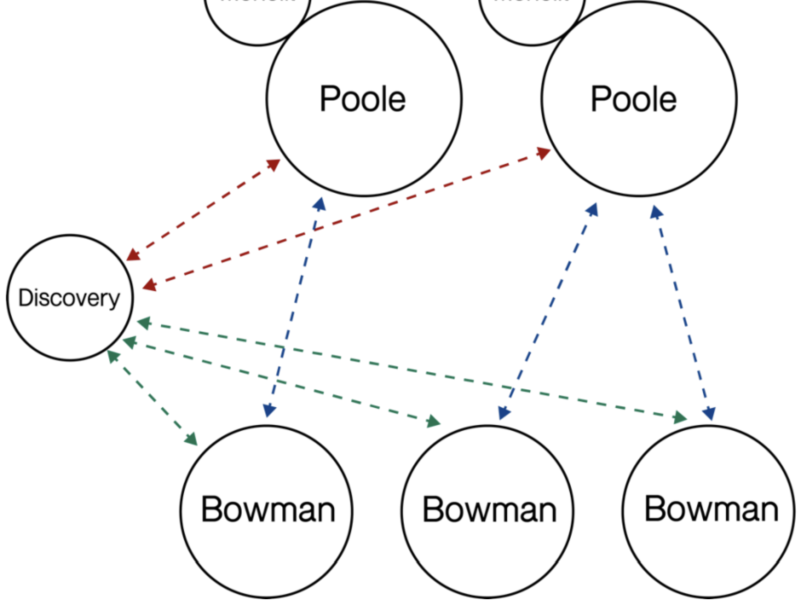

## Music server and client project, with connection load balancing

This project consisted in developing a system that allowed a set of devices using Linux to communicate with each other using sockets and the TCP/IP network, in order to transfer music from a server to a client. 

The system allows multiple music servers, multiple concurrent clients and has a connection load balancing server that helps with connecting each new user to the server that has the least load at the moment. 

Each server and client is a different process in the Linux device. The Poole processes are the music servers where the music is stored and transfered from. The Bowman processes are the different clients that want to see and download music and playlists. The Discovery process is the load balancing server, which distributes the load among the different Poole servers. 


## Instructions

0. **Song insertion**

   Place your song.mp3 files in the pooleProgram/data folder. Create a specific folder to insert the songs in a playlist. These songs and playlists will be available for all Bowman clients to download. 

1. **Start Discovery server**
   ```bash
   ./discovery (config_file_name)
   ```

2. **Start Poole server**
   ```bash
   ./poole (config_file_name)
   ```

3. **Start Bowman server**
   ```bash
   ./bowman (config_file_name)
   ```

4. **Connect to Poole server**
  In Bowman, use the following command to connect to Poole:
    ```bash
    connect
    ```

5. **Use available functions**
   - List songs
     ```bash
     list song
     ```

   - List playlists
     ```bash
     list playlist
     ```

   - Download song
     ```bash
     download (songName).mp3
     ```

   - Download playlist
     ```bash
     download (playlistName)
     ```

   - See downloads
     ```bash
     check downloads
     ```

   - Erase downloads
     ```bash
     clear downloads
     ```

   - Logout
     ```bash
     logout
     ```
    
The downloaded songs and playlists are located in bowmanProgram/data.

## Config files format

- Bowman config file

  //User name   
  //Folder where user files are located  
  //IP of Discovery server  
  //Port of Discovery server

- Poole config file

  //User name   
  //Folder where user files are located  
  //IP of Discovery server  
  //Port of Discovery server
  //IP where Poole server will be opened  
  //Port where Poole server will be opened

- Discovery config file

  //IP of Discovery server where it will listen for Poole connections  
  //Port of Discovery server where it will listen for Poole connections  
  //IP of Discovery server where it will listen for Bowman connections  
  //Port of Discovery server where it will listen for Bowman connections 

<br/>

**IMPORTANT**:
It is especially important that configuration files are created in the Linux environment using Vim or similar, as otherwise some file strings may not be read correctly.

## Connection diagram



## Authors

[Pol Valero] (https://github.com/pol-valero)

[Alex Liu] (https://github.com/Alello23)